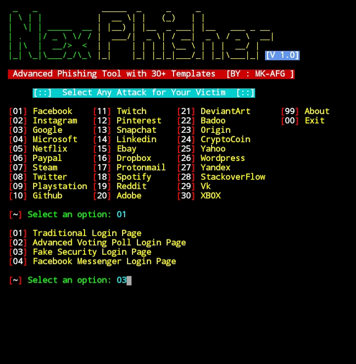
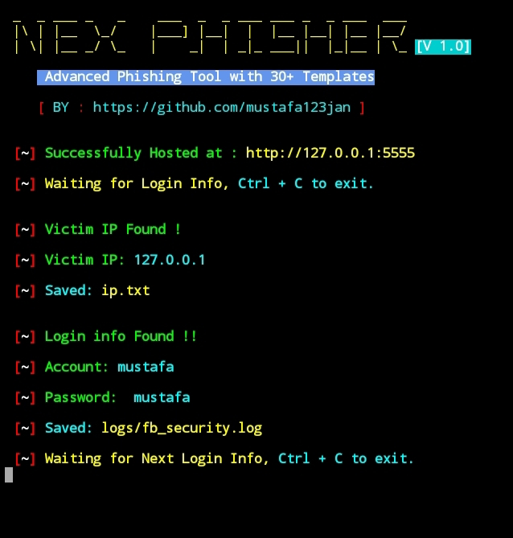

<p align="left">
<a href="#"></a>
</p>
<p align="center">
<a href="#"></a>
</p>

<p align="center">
<a href="#"></a>

## Installation :

* `apt update`
* `apt install git -y`
* `git clone git://github.com/mustafa123jan/nexphisher.git`
* `cd nexphisher`
#### > SETUP : `bash setup`
#### > SETUP [TERMUX] : `bash tmux_setup`
#### > Run : `bash nexphisher`

## Single Command :
```
apt update ; apt install git -y ; git clone git://github.com/mustafa123jan/nexphisher.git ; cd nexphisher ; bash setup ; bash nexphisher
```
<br>
<p align="center">



### <<< If you copy , Then Give me The Credits >>>

## Features :
#### [+] Latest Login Pages !
#### [+] 5 Port Forwarding Options !
#### [+] Easy for Beginners !


## Tunelling Options :
#### > Localhost (127.0.0.1)
#### > NGROK (https://ngrok.com)
#### > SERVEO (https://serveo.net)
#### > LOCALHOSTRUN (https://localhost.run)
#### > LOCALXPOSE (https://localxpose.io/)

## Find Me on :
[](https://github.com/mustafa123jan)
[](https://www.instagram.com/mustafa.kamgar)
[](https://m.me/mustafa.kamgar.1)


